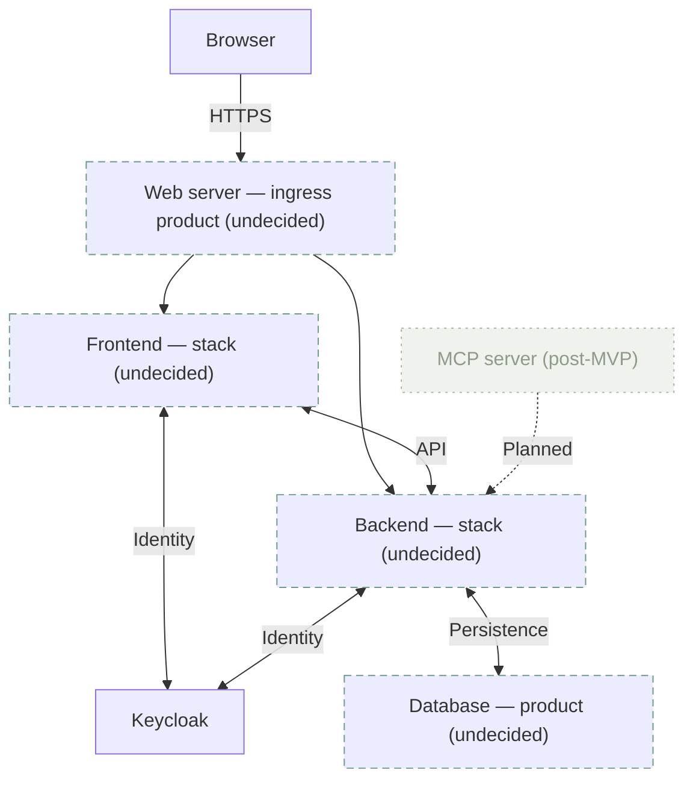

# Architecture overview

System-level source for this static presentation. Update it with architecture decisions; keep the browser source in sync.

```mermaid
flowchart TB
  Browser["Browser"]
  Web["Web server — ingress product (undecided)"]
  Frontend["Frontend — stack (undecided)"]
  Backend["Backend — stack (undecided)"]
  Keycloak["Keycloak"]
  Database["Database — product (undecided)"]
  MCP["MCP server (post-MVP)"]
  Browser -->|HTTPS| Web
  Web --> Frontend
  Web --> Backend
  Frontend <-->|API| Backend
  Frontend <-->|Identity| Keycloak
  Backend <-->|Identity| Keycloak
  Backend <-->|Persistence| Database
  MCP -.->|Planned| Backend
  classDef undecided stroke:#719a86,stroke-dasharray:6 4
  classDef later fill:#f0f3ed,color:#8e9b88,stroke:#a7b3a5,stroke-dasharray:2 4
  class Web,Frontend,Backend,Database undecided
  class MCP later
```
